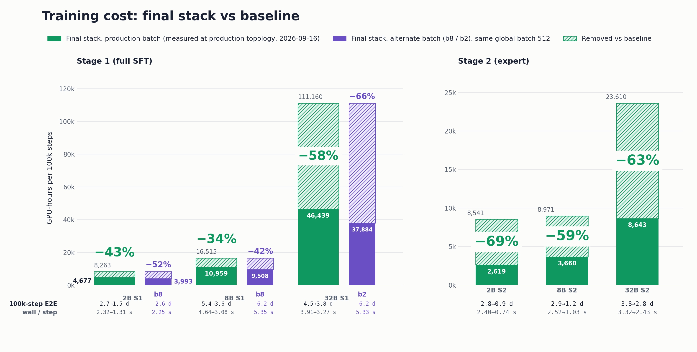

## 当前优化成果

覆盖 2B / 8B / 32B 三种模型规模、S1(全量 SFT)/ S2(冻结 backbone 训专家头)两个训练阶段,在各自的生产拓扑(8-64 节点)下实测: **GPU-hours 可降低约 50%**。



| 模型 · 阶段 | 每GPU batch | 拓扑 | 优化前 s/step | 优化后 s/step | GPU-hours 变化 | 端到端天数(100k步) |
| --- | --- | --- | ---: | ---: | ---: | --- |
| 2B S1 | b4 | FSDP8 × 16 GPU | 2.324 | **1.315** | **−43%** | 2.69d → 1.52d |
| 2B S2 | b4 | dp_shard1 × 128 GPU | 2.402 | **0.737** | **−69%** | 2.78d → 0.85d |
| 8B S1 | b4 | FSDP8 × 16 GPU | 4.645 | **3.082** | **−34%** | 5.38d → 3.57d |
| 8B S2 | b4 | FSDP8 × 16 GPU | 2.523 | **1.029** | **−59%** | 2.92d → 1.19d |
| 32B S1 | b1 | FSDP16 × 32 GPU | 3.908 | **3.265** | **−58%** | 4.52d → 3.78d |
| 32B S2 | b4 | FSDP8 × 16 GPU | 3.320 | **2.431** | **−63%** | 3.84d → 2.81d |

> wall(s)/step 为真实 wall-clock 时间(不是 trainer 日志的 iteration time)。
>
>100k-E2E GPU-hours 按 global batch 512、100k 步折算。
>
> 图中紫色的 b8/b2 备选 batch:它们把 GPU 数砍半、每个 GPU 的 batch 翻倍,global batch 仍保持 512,所以 100k 步端到端反而变长(2B S1 b8 2.6 天、8B S1 b8 6.2 天、32B S1 b2 6.2 天),但用更少的 GPU 就能跑完,且单样本成本更低(2B −13.2%、8B −10.5%、32B S1 −14.6%)——是"用更少 GPU、更长时间"换"更低总成本"的另一种选择。

## 优化方向


```
[01 数据加载 Data Loading] ──CPU──► [02 传输与Step收尾开销 Transport & Step Overhead] ──H2D(CPU→GPU)──► [03 前向反向 Forward & Backward] ──GPU──► [04 并行与显存 Parallelism & Memory]
```

- **01 数据加载**:存储 → 解码 → CPU 预处理 → worker CPU 调度与内存
- **02 传输与 Step 收尾开销**:打包 / H2D 拷贝 / GC 冻结 / collective 融合上报
- **03 前向反向**:前向反向 / attention kernel / 编译器
- **04 并行与显存**:并行 layout / FSDP / 跨 GPU 通信 / 显存管理

另外两类是基础设施:

- **05 测量评估**(贯穿 01-04):per-rank telemetry、CUDA-event 分解、MFU/HFU/OFU、固定参照跑的 regression bands — 回答"怎么知道哪一段慢"
- **06 方法论**(贯穿 01-04):same-window paired runs、bitwise-invariance 门禁、dose-response ladder、证伪循环 — 回答"怎么证明一个改动真的生效、且没有破坏正确性"


## 补充说明: 命名

**Stall**

一个训练 step 里,最慢的那个 rank(GPU)要等数据等多久。

- severe stall:某个 step 里,各个 rank 准备好数据的时间差 > 2 秒——意味着有个 rank(数据没准备好)让其它所有 rank(GPU)干等超过 2 秒,这 2 秒 GPU 完全在空转,是纯粹的浪费
- stall 负担(stall burden):衡量的是"这种严重卡顿在所有 step 里占的比例有多高",比如"9.1%(89/980 steps)"就是这个意思——980 个训练 step 里,有 89 个 step 撞上了 severe stall

**S1 / S2**

Alpamayo 训练流程里的两个训练阶段。

- S1(Stage 1):全量 SFT 训练,训练整个模型(包括 backbone)
- S2(Stage 2):专家头训练,backbone 冻结不动,只训练一个小的 expert 模块

S1/S2 计算量差别很大——S2 每步计算量小,CPU 侧的固定开销(worker 解码、内存分配等)在总 step 时间里占比更显眼,更容易暴露出数据侧瓶颈;两者的最优 worker 数/batch size 等配置也不一样,所以文档里的优化收益通常要分 S1/S2 分别报数字。

---

本目录会持续更新训练优化方法，部分内容还在做梳理,敬请期待。
