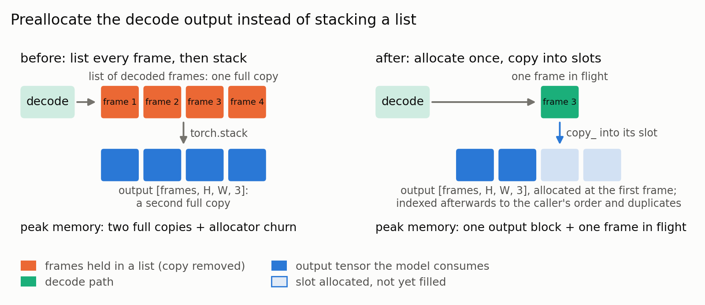
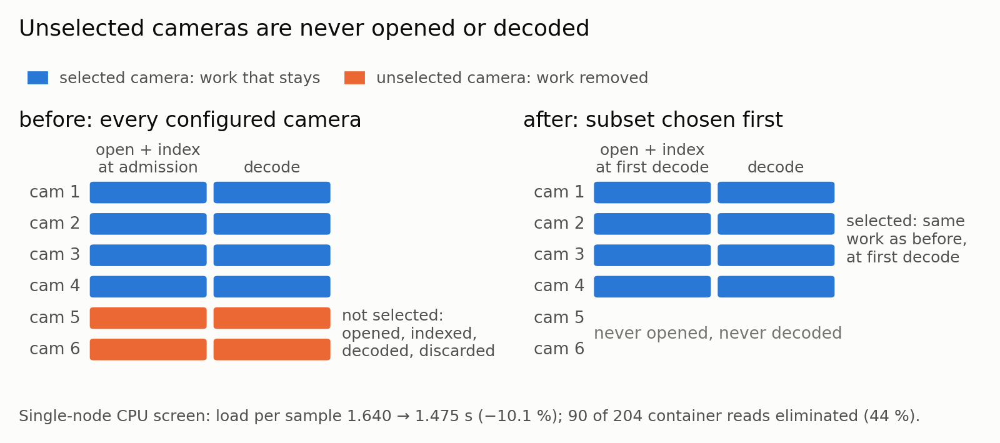
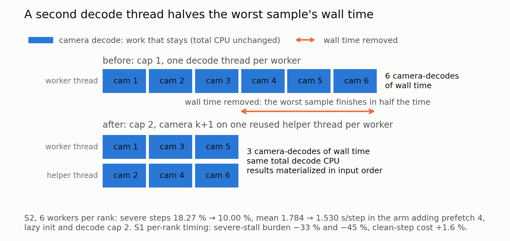

## Summary
优化项持续更新: 覆盖存储→解码→CPU预处理→worker调度与内存管理的 Dataloader 相关链路。
1. 预先分配每帧数据内存占用,实现一次解码内存搬运
2. 多相机按需加载(lazy initialization)
3. 相机解码线程并发 `camera_decode_max_concurrency`

---

## 1. 预先分配每帧数据内存占用，实现一次解码内存搬运

**思路**:



第一帧解码出来时就直接申请好最终的`[N, H, W, 3]`连续buffer,后续每帧解码完直接`.copy_()`写进它在buffer里该在的位置,不再需要"先分散存、最后再stack"这两步。

**收益**:独立测:loader吞吐 **+33.9%**,stall负担 **−82.7%**,单样本加载 −20~30%。

**实现**:
- public github [TBD]
- internal gitlab [`0d53ef73e8`](https://gitlab-master.nvidia.com/alpamayo/alpamayo/-/commit/0d53ef73e8)

改动前:
```python
collected: dict[int, torch.Tensor] = {}
# 解码循环里,每解出一帧就存进字典
collected[cur_frame_idx] = torch.as_tensor(frame.to_ndarray(format="rgb24"))
...
# 全部解码完后,按顺序取出、再 stack 成一个大tensor
collected = [collected[i] for i in unique_frame_idxs]
tensors = torch.stack(collected)
```

改动后:
```python
output_slots = {frame_idx: i for i, frame_idx in enumerate(unique_frame_idxs)}
tensors: torch.Tensor | None = None

# 解码循环里
frame_tensor = torch.as_tensor(frame.to_ndarray(format="rgb24"))
if tensors is None:
    # 第一帧解码出来时,才知道frame的shape,这时候一次性申请好最终大小的buffer
    tensors = frame_tensor.new_empty((len(unique_frame_idxs), *frame_tensor.shape))
tensors[output_slots[cur_frame_idx]].copy_(frame_tensor)  # 直接原地拷进最终位置
```

如果传进来的frame尺寸跟预分配的buffer不匹配,`copy_()`会直接报错崩溃, 给`torch.stack`打了monkeypatch,一旦被调用就抛异常。

**适用场景**:不局限于视频解码——任何时候看到一个循环在**不断往列表/字典里塞tensor,最后再统一调一次`stack`/`cat`**,都可以套用这个思路:提前知道最终大小 → 一次性分配好buffer → 循环里直接写进对应位置,省掉最后那次多余的整体拷贝。

---

## 2. 多相机按需加载(lazy initialization)

**思路**:



每个训练sample来自一个6相机拍摄的driving clip,但一个sample平均只用到约4.1个相机——因为配置里的`camera_subsample_weights`会按权重给每个sample预先抽签,分配到一个"相机子集方案"(比如全部6个/只用前3个等),不是每个sample都用全部6个,这是一种数据增强手段。改动前,clip admission阶段会**提前打开全部6个相机的MP4文件**并建好keyframe索引,不管这个相机后面用不用得到。改动后引入 `DeferredVideoReader`,只记录相机路径(`video_path`字符串),把真正打开文件、构造具体reader(`SeekVideoReader`等)这一步**推迟到第一次真正解码这个相机时才做**——没被选中的相机永远不会被打开。

**收益**:`mean_load_s_per_sample` 1.640→**1.475**(−10.1%);全SFT A/B:全步wall **−5.7%**,severe stalls **−30%**;204次相机payload读取消除90次(**−44%**)。

**实现**:
- public github [TBD]
- internal gitlab [`43b6c87bbb`](https://gitlab-master.nvidia.com/alpamayo/alpamayo/-/commit/43b6c87bbb)

改动前:
```python
# clip admission阶段,eagerly打开全部6个相机
owned_handles = []
for camera_name in self._camera_names_in_order():
    reader, handle = self._build_camera_reader(camera_name)  # 立刻 open(video_path, "rb")
    clip[camera_name] = reader
    owned_handles.append(handle)
```

改动后:
```python
class DeferredVideoReader(VideoReader):
    """Path-backed reader that opens its concrete reader on first decode."""

    def __init__(self, video_path, timestamps, reader_cls, thread_count):
        super().__init__(io.BytesIO(), timestamps, thread_count)
        self._video_path = video_path      # 只记路径,不open文件
        self._reader_cls = reader_cls
        self._reader: VideoReader | None = None

    @property
    def initialized(self) -> bool:
        return self._reader is not None

    def _get_reader(self) -> VideoReader:
        """懒加载核心:第一次调用才真正open文件+构造reader,之后直接复用缓存。"""
        reader = self._reader
        if reader is None:                     # 还没初始化过
            video_handle = open(self._video_path, "rb")           # 这里才真正open文件
            reader = self._reader_cls(video_handle, self.timestamps, thread_count=self._thread_count)
            self._reader = reader               # 缓存住,下次不再重复open
        return reader                           # 已初始化过 / 刚初始化完,都走这一行返回

    # 两个对外解码接口都不直接碰文件,而是先经过 _get_reader() 触发/复用懒加载
    def decode_images_from_timestamps(self, requested_timestamps):
        return self._get_reader().decode_images_from_timestamps(requested_timestamps)

    def decode_images_from_frame_indices(self, frame_indices):
        return self._get_reader().decode_images_from_frame_indices(frame_indices)
```

admission阶段现在只是把6个 `DeferredVideoReader`(不含文件句柄)塞进clip字典,谁都没有真正打开文件;之后 `decode_images_from_frame_indices` 第一次被调用时才 lazy 构造出真正的 `SeekVideoReader` 并打开MP4。

**适用场景**:任何时候,只要"初始化/准备资源"这个动作的开销是**跟着配置里声明的全集走**(比如这里配了6个相机),而不是**跟着实际用到的子集走**(一个sample平均只用4.1个),就该考虑把初始化推迟到"确定真的要用这个资源了"那一刻——即"声明的规模 > 实际用到的规模"时,懒加载才有意义;如果两者总是相等(比如每次都真的要用全部资源),懒加载就没有收益。

---

## 3. 相机解码线程并发 `camera_decode_max_concurrency`

**思路**:



worker解码器严格单线程串行(`video_decode_thread_count=1`,因为80个worker进程/node不能各配一个FFmpeg线程池),六相机、4帧的sample要解30-50帧HEVC 1080p,重样本的长尾延迟会拖垮整批——一个worker进程内部按FIFO顺序交付sample,轮到重样本就必须先解完它才能交下一个;而分布式训练要求所有rank都凑齐batch才能开始这一步,只要80个worker里有任意1个卡在重样本上,其余全部rank(哪怕早就准备好了)都得陪着空等,这就是severe stall的触发场景。

改动给每个worker进程配一个**复用的helper线程**(`os.register_at_fork`保证fork安全,进程私有、只建一次、之后反复复用,不是每次现开现销毁):把要解的相机两两分批(`camera_decode_max_concurrency=2`),每一批里,主线程解第1个相机的同时,helper线程并发解第2个,结果严格按输入顺序落地;下一批再依次进行,不是把选中的相机一次性全丢给2个线程。并发上限用schema锁死为2(`Literal[1, 2]`),测过把上限抬到4是倒退(+12%,SMT硬件线程预算被挤爆)。

**收益**:分三组场景测试
- **S1,同node配对A/B**:stall gap(每step因stall多花的时间)**−0.050s/step**;severe负担**−33%~−45%**;副作用检查——即使完全没撞上重样本的"干净路径",代价也只**+1.6%**（落在±2%的节点噪声范围内,基本可以认为无额外开销）
- **S2,6-worker(worker池小,单点重样本更容易拖垮全局)**:叠加"懒加载+受限解码并发"后,severe steps **18.27%→10.00%**("prefetch4+懒加载+解码并发"三者一起叠加的效果)
- **S2,10-worker(worker池够大 + 瓶颈见下文CPU预处理相关技术)**:severe steps 16.5%→16.5%,无明显收益。原因:①池子够大时,一个worker卡住,其余worker能顶上,不再是短板;②S2这里的severe stall根源其实是 allocator/32MB mmap阈值问题(CPU预处理小节),跟"重样本长尾延迟"是两种情况。

**实现**:
- public github [TBD]
- internal gitlab [`!2859`](https://gitlab-master.nvidia.com/alpamayo/alpamayo/-/merge_requests/2859)

改动前:
```python
# 相机严格串行解码
image_data = {}
for camera_name in cameras_to_load:
    video_cache: VideoReader = clip.cached_data[camera_name]
    images, timestamps = video_cache.decode_images_from_timestamps(t0s)
    image_data[camera_name] = ImageSample(images=images, timestamps=timestamps)
```

改动后:
```python
class _CameraDecodeHelper:
    """每个DataLoader worker进程懒加载出一个复用的单线程helper executor。"""
    def get(self) -> ThreadPoolExecutor:
        with self._lock:
            if self._executor is None:
                self._executor = ThreadPoolExecutor(max_workers=1, ...)
            return self._executor

_CAMERA_DECODE_HELPER = _CameraDecodeHelper()
os.register_at_fork(after_in_child=_CAMERA_DECODE_HELPER.reset_after_fork)  # fork-safe

def _decode_camera_pair(first_reader, second_reader, t0s):
    """第二个相机丢给helper线程解码,第一个相机留在调用者线程,结果按输入顺序返回。"""
    second_future = _CAMERA_DECODE_HELPER.get().submit(_decode_camera, second_reader, t0s)
    first_sample = _decode_camera(first_reader, t0s)
    return first_sample, second_future.result()

# 按 camera_decode_max_concurrency(1或2)分组处理
for start in range(0, len(camera_order), group_size):
    camera_names = camera_order[start : start + group_size]
    readers = [clip.cached_data[name] for name in camera_names]
    samples = _decode_camera_pair(readers[0], readers[1], t0s) if len(readers) == 2 \
        else (_decode_camera(readers[0], t0s),)
```

`camera_decode_max_concurrency`是走pydantic配置校验的显式开关:必须是1或2,且`=2`时强制要求`video_cache_type="seek"`且`video_decode_thread_count=1`,配置不满足直接报错,不会静默生效成错误行为。
